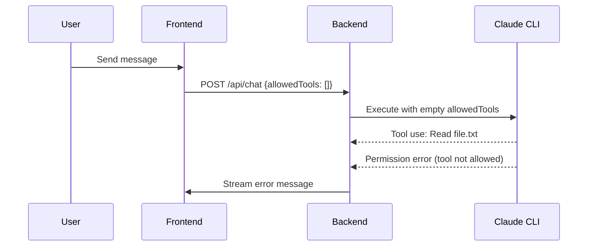

# Claude Code WebUI Interactive Permissions: Technical Deep Dive

This document provides a comprehensive technical analysis of how `sugyan/claude-code-webui` implements its unique interactive permission system.

## Overview: The Permission Challenge

Traditional Claude CLI integrations use `--dangerously-skip-permissions` to bypass all permission checks. Claude Code WebUI takes a fundamentally different approach by implementing **runtime permission dialogs** that allow users to grant permissions on-demand while maintaining security.

## Architecture Components

### 1. Permission Detection System

The system detects permission requests through **error message pattern matching**:

```typescript
// frontend/src/utils/messageTypes.ts
export function isPermissionError(content: string): boolean {
  return (
    content.includes("requested permissions") ||
    content.includes("haven't granted it yet") ||
    content.includes("permission denied")
  );
}
```

When Claude CLI encounters a permission restriction, it returns an error message containing these specific phrases.

### 2. SDK Integration Layer

The backend uses the official `@anthropic-ai/claude-code` SDK (v1.0.33):

```typescript
// backend/handlers/chat.ts
for await (const sdkMessage of query({
  prompt: processedMessage,
  options: {
    ...(allowedTools ? { allowedTools } : {}),  // Key permission control
    ...(sessionId ? { resume: sessionId } : {}),
    ...(workingDirectory ? { cwd: workingDirectory } : {}),
  },
})) {
  yield { type: "claude_json", data: sdkMessage };
}
```

The `allowedTools` array is passed directly to the Claude CLI via the SDK.

## Complete Permission Flow

### Step 1: Initial Tool Use Attempt



### Step 2: Permission Error Detection

The frontend processes the stream and detects permission errors:

```typescript
// frontend/src/hooks/streaming/useToolHandling.ts
const processToolResult = useCallback((
  contentItem: { tool_use_id?: string; content: string; is_error?: boolean },
  context: StreamingContext,
) => {
  const content = contentItem.content;
  
  // Check if this is a permission error
  if (contentItem.is_error && isPermissionError(content)) {
    handlePermissionError(contentItem, context);
    return; // Don't process as regular tool result
  }
  
  // Regular tool result processing...
}, [handlePermissionError]);
```

### Step 3: Tool Information Extraction

The system maintains a cache of tool use information:

```typescript
// frontend/src/hooks/streaming/useStreamParser.ts
const processToolUse = useCallback((contentItem: any) => {
  // Cache tool information for later correlation
  toolUseCache.set(contentItem.id, contentItem.name, contentItem.input || {});
  
  // Display tool use to user
  addMessage({
    type: "tool",
    name: contentItem.name,
    input: contentItem.input,
    id: contentItem.id,
  });
}, [toolUseCache, addMessage]);
```

### Step 4: Permission Dialog Triggering

When a permission error is detected:

```typescript
// frontend/src/hooks/streaming/useToolHandling.ts
const handlePermissionError = useCallback((
  contentItem: { tool_use_id?: string; content: string },
  context: StreamingContext,
) => {
  // 1. Abort the current request stream
  if (context.onAbortRequest) {
    context.onAbortRequest();
  }

  // 2. Get cached tool information
  const toolUseId = contentItem.tool_use_id || "";
  const cachedToolInfo = toolUseCache.get(toolUseId);
  
  // 3. Extract tool name and command
  const { toolName, command } = extractToolInfo(
    cachedToolInfo?.name,
    cachedToolInfo?.input,
  );

  // 4. Generate permission pattern
  const pattern = generateToolPattern(toolName, command);
  
  // 5. Show permission dialog
  if (context.onPermissionError) {
    context.onPermissionError(toolName, pattern, toolUseId);
  }
}, [toolUseCache]);
```

### Step 5: Tool Pattern Generation

Different tools generate different permission patterns:

```typescript
// frontend/src/utils/toolUtils.ts
export function generateToolPattern(toolName: string, command: string): string {
  return toolName === "Bash" && command !== TOOL_CONSTANTS.WILDCARD_COMMAND
    ? `${toolName}(${command}:*)`  // Bash commands get specific patterns
    : toolName;                    // Other tools use simple name
}

// Examples:
// Read tool → "Read"
// Write tool → "Write" 
// Bash with "ls" → "Bash(ls:*)"
// Bash with "npm test" → "Bash(npm test:*)"
```

### Step 6: Permission Dialog UI

The permission dialog presents three options:

```typescript
// frontend/src/components/PermissionDialog.tsx
export function PermissionDialog({
  isOpen,
  toolName,
  pattern,
  onAllow,           // Temporary permission
  onAllowPermanent,  // Permanent permission
  onDeny,            // Deny permission
}: PermissionDialogProps) {
  return (
    <Dialog open={isOpen}>
      <DialogContent>
        <DialogHeader>
          <DialogTitle>Claude requests permission</DialogTitle>
          <DialogDescription>
            Claude wants to use <code>{toolName}</code>
          </DialogDescription>
        </DialogHeader>
        <DialogFooter>
          <Button onClick={onAllow}>Yes</Button>
          <Button onClick={onAllowPermanent}>
            Yes, and don't ask again for {toolName}
          </Button>
          <Button variant="outline" onClick={onDeny}>No</Button>
        </DialogFooter>
      </DialogContent>
    </Dialog>
  );
}
```

### Step 7: Permission Response Handling

When the user grants permission:

```typescript
// frontend/src/components/ChatPage.tsx
const handlePermissionAllow = useCallback(() => {
  if (!permissionDialog) return;
  
  const pattern = permissionDialog.pattern;
  closePermissionDialog();
  
  if (currentSessionId) {
    // Send "continue" with temporarily updated allowedTools
    sendMessage("continue", allowToolTemporary(pattern), true);
  }
}, [permissionDialog, currentSessionId, sendMessage, allowToolTemporary]);

const handlePermissionAllowPermanent = useCallback(() => {
  if (!permissionDialog) return;
  
  const pattern = permissionDialog.pattern;
  const updatedAllowedTools = allowToolPermanent(pattern);
  closePermissionDialog();
  
  if (currentSessionId) {
    // Send "continue" with permanently updated allowedTools
    sendMessage("continue", updatedAllowedTools, true);
  }
}, [permissionDialog, currentSessionId, sendMessage, allowToolPermanent]);
```

### Step 8: Permission State Management

The permission hooks manage allowed tools:

```typescript
// frontend/src/hooks/chat/usePermissions.ts
export function usePermissions() {
  const [allowedTools, setAllowedTools] = useState<string[]>([]);

  const allowToolTemporary = useCallback((pattern: string) => {
    // Return new array with temporary permission
    return [...allowedTools, pattern];
  }, [allowedTools]);

  const allowToolPermanent = useCallback((pattern: string) => {
    // Add to permanent allowed tools
    setAllowedTools(prev => [...prev, pattern]);
    return [...allowedTools, pattern];
  }, [allowedTools]);

  return {
    allowedTools,
    allowToolTemporary,
    allowToolPermanent,
  };
}
```

### Step 9: Continue Request

When permission is granted, a new request is sent:

```typescript
// frontend/src/hooks/chat/useChat.ts
const sendMessage = useCallback(async (
  message: string,
  toolsOverride?: string[],
  isContinue = false
) => {
  const requestBody = {
    message,
    sessionId: currentSessionId,
    requestId: generateRequestId(),
    allowedTools: toolsOverride || allowedTools,  // Updated permissions
    workingDirectory: projectPath,
  };

  // Stream the response
  const response = await fetch('/api/chat', {
    method: 'POST',
    headers: { 'Content-Type': 'application/json' },
    body: JSON.stringify(requestBody),
  });

  // Process streaming response...
}, [currentSessionId, allowedTools, projectPath]);
```

### Step 10: Resumed Execution

The backend receives the continue request with updated permissions:

```typescript
// backend/handlers/chat.ts
export async function handleChatRequest(c: Context) {
  const body = await c.req.json();
  const { message, sessionId, allowedTools, workingDirectory } = body;

  // Process with updated allowedTools array
  for await (const sdkMessage of query({
    prompt: message,  // "continue" 
    options: {
      resume: sessionId,
      allowedTools: allowedTools,  // Now includes the granted permission
      cwd: workingDirectory,
    },
  })) {
    // Stream continues with new permissions
    yield { type: "claude_json", data: sdkMessage };
  }
}
```

## Key Technical Insights

### 1. No CLI Flag Modifications

Unlike other implementations, this system **never uses `--dangerously-skip-permissions`**. Instead, it:
- Uses the SDK's built-in `allowedTools` mechanism
- Starts with an empty permissions array
- Adds permissions only when user explicitly grants them

### 2. Error-Driven Permission Requests

The system doesn't predict what permissions Claude needs. Instead:
- Claude attempts the operation
- Gets a permission error
- Error is caught and converted to a user dialog
- User decides whether to grant permission
- Execution continues with updated permissions

### 3. Pattern-Based Permissions

Permissions are granted as patterns, not just tool names:
- `"Read"` - allows all Read operations
- `"Bash(ls:*)"` - allows only `ls` bash commands
- `"Write"` - allows all Write operations

### 4. Stream Abortion and Continuation

When a permission error occurs:
- Current stream is immediately aborted
- User sees the permission dialog
- If granted, a new "continue" request resumes from where it left off
- If denied, the operation stops

### 5. Tool Use Correlation

The system correlates tool uses with their results:
- Tool uses are cached by ID when first seen
- Permission errors reference the tool use ID
- This allows extracting the exact tool name and parameters

## Advantages of This Approach

1. **True Security**: No blanket permissions granted
2. **User Control**: User sees and approves each tool request
3. **Granular Permissions**: Tool+pattern specific control
4. **Audit Trail**: Clear record of what was permitted
5. **Seamless UX**: Conversation continues after permission grant
6. **No CLI Modification**: Works with standard Claude CLI

## Limitations

1. **Workflow Interruption**: Dialogs pause the conversation
2. **User Attention Required**: Cannot run fully automated
3. **Permission Complexity**: Users need to understand patterns
4. **SDK Dependency**: Relies on SDK's permission handling

## Conclusion

Claude Code WebUI's interactive permission system represents a sophisticated balance between security and usability. By leveraging error-driven permission requests and runtime user dialogs, it provides granular security control while maintaining conversational flow.

The technical implementation is elegant in its simplicity:
- No custom CLI modifications needed
- Uses standard SDK mechanisms
- Converts permission errors to user interactions
- Maintains conversation continuity through stream abortion and continuation

This approach could serve as a model for other Claude CLI integrations that need to balance capability with security in multi-user or sensitive environments.