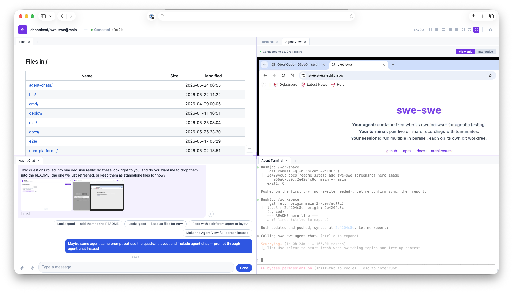

# swe-swe

**Your agent:** containerized with its own browser for agentic testing.<br>
**Your terminal:** pair live or share recordings with teammates.<br>
**Your sessions:** run multiple in parallel, each on its own git worktree.

Works with Claude, Codex, OpenCode, Gemini, Aider, Goose, and Pi. Not listed? [Let us know](https://github.com/choonkeat/swe-swe/issues)!



## Features

- **Containerized agent + browser**: each session runs in its own container with a browser for agentic testing (Playwright MCP plus a live Agent View).
- **Parallel sessions on git worktrees**: run several agents at once, each isolated on its own worktree.
- **Live pairing and recordings**: pair on a live terminal, or share session recordings with teammates.
- **Remote access via tunnel mode**: reach a container over the public internet with no open ports and no TLS to manage -- the container dials out. See [Tunnel mode explained](docs/tunnel-explained.md), plus the runbooks for [laptop](docs/tunnel-laptop.md), [Fly.io](docs/tunnel-fly.md), and [PaaS](docs/tunnel-paas.md).
- **One-container deploy**: ship to Fly.io / Railway / Render / Cloud Run.
- **SSH commit signing**: sign commits with a per-session key that never touches disk.
- **Skills from any git repo**: `swe-swe init --with-skills <alias>@<url>` clones external skill repos and surfaces them to the agent.
- **Built-in panes**: live preview, a read-only Files browser, VS Code (code-server), and agent chat.
- **Multi-service apps without Docker**: declare your services in a `Procfile` and `swe-run` supervises them, each reachable in App Preview. See [Multi-service apps](docs/multi-service.md).
- **Dockerless mode**: `swe-swe init --dockerless` runs everything host-native from prebuilt binaries -- no Docker required. See [dockerless](docs/dockerless.md).

## Quick Start

1. **Install swe-swe**

   Option A: run via npx (requires Node.js)
   ```bash
   alias swe-swe='npx -y swe-swe'
   ```

   Option B: install via curl
   ```bash
   curl -fsSL https://raw.githubusercontent.com/choonkeat/swe-swe/main/install.sh | sh
   ```

2. **Go to your project**
   ```bash
   cd /path/to/your/project
   ```

3. **Start**
   ```bash
   swe-swe up
   ```

4. **Open** http://localhost:1977

### Requirements

- Docker & Docker Compose installed -- or none at all, if you use [dockerless mode](docs/dockerless.md)
- Terminal access (works on macOS, Linux, Windows with WSL)

### Without Docker

On a Linux host you can skip containers entirely: `swe-swe init --dockerless`
writes the embedded server and helper binaries into `.swe-swe/`, and `swe-swe up`
runs them directly on the host in the foreground. On macOS, run it inside a Linux
VM -- see [dockerless on a Mac](docs/dockerless-mac-vm.md).

## Commands

For the full command reference -- all flags, examples, environment variables, and architecture details -- see [docs/cli-commands-and-binary-management.md](docs/cli-commands-and-binary-management.md). For configuration options, see [docs/configuration.md](docs/configuration.md).

**Quick reference:**

```bash
# Native commands
swe-swe init [options]          # Initialize a project (advanced; `up` does this interactively)
swe-swe list                    # List initialized projects
swe-swe proxy <command>         # Bridge host commands into containers

# Docker Compose pass-through (all other commands)
swe-swe up                      # Start the environment (runs interactive setup on first use)
swe-swe down                    # Stop the environment
swe-swe build                   # Rebuild Docker images
swe-swe ps / logs / exec ...    # Any docker compose command
```

Use `--project-directory` to specify which project (defaults to current directory). The port defaults to `1977` and can be customized via `SWE_PORT`.

In a project initialized with `--dockerless` there is no compose file: `swe-swe up` runs the server on the host in the foreground (Ctrl-C to stop), and the compose-only commands do not apply.

## Documentation

- [Configuration Reference](docs/configuration.md) - all init flags, environment variables, and config files
- [CLI Commands and Build Architecture](docs/cli-commands-and-binary-management.md) - full command reference, troubleshooting, build system
- [Dockerless](docs/dockerless.md) - run host-native with no Docker, plus the [Mac + Linux VM runbook](docs/dockerless-mac-vm.md)
- [Multi-service apps](docs/multi-service.md) - Procfile + `swe-run` + App Preview
- [Browser Automation](docs/browser-automation.md) - Chrome CDP and MCP Playwright
- [WebSocket Protocol](docs/websocket-protocol.md) - terminal communication protocol
- **Tunnel mode** - reach a container from the public internet: [explained](docs/tunnel-explained.md), [laptop](docs/tunnel-laptop.md), [Fly.io](docs/tunnel-fly.md), [PaaS](docs/tunnel-paas.md)

## Development

```bash
make build    # Build CLI binaries for all platforms
make test     # Run tests
```

See [docs/cli-commands-and-binary-management.md](docs/cli-commands-and-binary-management.md) for build architecture and troubleshooting.

## License

See LICENSE file for details.
